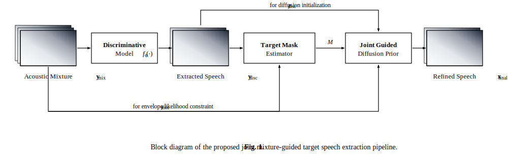

# Generative Refinement for Target Speech Extraction using Joint Mixture-Guided Diffusion Priors

This repository contains the official implementation of **Joint Mixture Guidance (V1)**, a training-free generative posterior sampling framework for Target Speech Extraction (TSE). 

Developed during the **Summer Research Internship (SRI) program at DAU**, this framework bridges the gap between discriminative voice separation and generative speech synthesis. By guiding a pre-trained single-speaker diffusion prior using a dynamic energy mask derived from a discriminative front-end, our approach isolates target speakers without the artificial processing distortions (robotic voice) typical of discriminative models, while actively preventing vocal hallucinations and speaker identity drift.

---

## 🚀 Key Contributions
1. **Training-Free Hybrid Pipeline:** Integrates a high-performance discriminative model (USEF-TSE using TFGridNet) with a generative diffusion prior (ArrayDPS) without requiring joint training or retraining.
2. **Sliding-Window Chunking:** Resolves memory constraints on long speech mixtures by implementing a 4-second sliding window for discriminative extraction.
3. **Dynamic Target Gating:** Computes a local energy-based target mask from the discriminative output to partition target speaker speech from silent or overlapping sections.
4. **Envelope Boundary Guidance:** Uses a masked $L_2$ loss to anchor reverse diffusion trajectories to the original mixture envelope, preventing speaker drift in active regions and hallucinations in silent gaps.

---

## 📐 System Pipeline Architecture

The end-to-end framework operates in two distinct phases:
1. **Phase 1 (Discriminative Extraction):** The raw mixture and target speaker's enrollment cue are processed in sliding windows by the TFGridNet front-end to yield an initial, structured target voice approximation.
2. **Phase 2 (Generative Refinement):** The initial approximation is refined using reverse diffusion steps. The guidance loss guides the denoising process, matching the original mixture envelope inside the target speech mask.



---

## 📂 Repository Structure

The code is organized to keep the main working files clean at the root level, while archiving all developmental progress stages under `previous_versions/`:

*   **Root Level:** Holds the final working pipeline, backbones, and data dependencies:
    *   [`run_v1_inference.py`](run_v1_inference.py): The main user entry point (Phase 1 + Phase 2 Joint Mixture Guidance). Auto-downloads weights if missing.
    *   [`results/`](results): Contains final clean & noisy Libri2Mix evaluation outputs (individual metric logs, running averages, and categorizations).
    *   [`ArrayDPS/`](ArrayDPS): Diffusion prior model backbone code.
    *   [`usef_tse_code/`](usef_tse_code): Discriminative model backbone code.
    *   [`test_samples/`](test_samples): WAV files for demo/testing.
    *   [`Report_Template/`](Report_Template): LaTeX report files and SVG diagram figures.
*   **[`previous_versions/`](previous_versions):** Grouped scripts corresponding to your 5 development stages:
    *   **`01_Discriminative_Only/`**: Scripts to run discriminative TFGridNet baseline.
    *   **`02_Prior_Only/`**: Reconstructs speech using only the diffusion prior (no guidance).
    *   **`03_Likelihood_on_Disc/`**: Guides diffusion using a likelihood loss on the masked discriminative output.
    *   **`04_Likelihood_on_Mix/`**: Bounds the prior using a likelihood loss directly on the raw unmasked mixture.
    *   **`05_Likelihood_on_Masked_Mix/`**: Development pipeline precursors to the final Joint Mixture Guidance framework.
    *   **`results_archive/`**: Archive of older intermediate evaluation runs (270-file baseline tests).

---

## 📈 Evolution of the Approach (Experimental Journey)

The final Joint Mixture Guidance framework was developed by iteratively trying different configurations to address specific failure modes:

1. **Discriminative Only (`TFGridNet`)**
   - **Method:** Standard speech extraction using only the discriminative neural network.
   - **Limitation:** Excellent at speaker isolation and noise reduction (high SI-SNR), but introduced processing artifacts, musical noise, and phase distortion, making the voice sound robotic.

2. **Prior Only (`ArrayDPS`)**
   - **Method:** Running the pre-trained diffusion prior starting from the discriminative output with *no guidance*.
   - **Limitation:** Restored natural voice texture and timbre, but suffered from **speaker identity drift** (target voice morphed into another person) and **speech hallucinations** (generating random words in silent or overlapping regions).

3. **Likelihood Guidance on Discriminative Output**
   - **Method:** Guiding the diffusion prior to align with the discriminative output ($y_{\text{disc}}$) during reverse steps.
   - **Limitation:** Stabilized speaker identity, but also pulled the prior back to the distorted discriminative phase, retaining the digital artifacts and limiting the naturalness boost.

4. **Likelihood Guidance on Raw Mixture**
   - **Method:** Guiding the diffusion prior to match the original mixture signal ($y_{\text{mix}}$) directly.
   - **Limitation:** While it preserved acoustic characteristics, without target speaker boundaries the prior was guided to reconstruct the interfering (background) talker, leading to severe speaker leakage.

5. **Masked Likelihood Guidance on Mixture (Joint Mixture Guidance - Final V1)**
   - **Method:** Computing a dynamic energy mask $M$ from the discriminative output, then guiding the prior to align with the raw mixture only in active target zones ($M = 1$) while letting the prior denoise freely in silent/overlapping regions ($M = 0$).
   - **Advantage:** Keeps the target speaker identity anchored to the mixture envelope, prevents background leakage and hallucinations, and maximizes voice naturalness (+0.345 DNSMOS boost).

---

## 🛠️ Installation & Setup

### 1. Clone the Repository
```bash
git clone https://github.com/your-username/DPS_TSE-Github.git
cd DPS_TSE-Github
```

### 2. Install Dependencies
Make sure you have Python 3.8+ installed. Install the required packages:
```bash
pip install -r requirements.txt
```

---

## 💻 How to Run Inference

We provide an end-to-end inference script `run_v1_inference.py` that handles the full pipeline (Phase 1 and Phase 2).

> [!NOTE]
> **Automatic Weight Downloader:** 
> When you run the inference script, it will check for the required checkpoints (`model_ckpt.pt` and `temp_best.pth.tar`). If they are missing, it will automatically download them from Hugging Face Hub and Box servers into the correct directories. You do not need to download them manually!

Run the pipeline on your own files or the provided test samples:
```bash
python run_v1_inference.py --mixture test_samples/LIBRI2MIX_mixture.wav --enrollment test_samples/LIBRI2MIX_s1.wav --output refined_output.wav
```

### Script Arguments:
- `--mixture`: Path to the input multi-speaker mixture audio file (8kHz `.wav`).
- `--enrollment`: Path to the target speaker's clean enrollment reference audio (8kHz `.wav`).
- `--output`: Path where the final high-fidelity refined audio will be saved.

---

## 📊 Experimental Results (Libri2Mix Benchmark)

The following table summarizes the performance on the Libri2Mix 8kHz test dataset. Our Joint Mixture-Guided generative model (Proposed V1) is compared against the discriminative baseline (TFGridNet):

| Method | D/G Type | Perceptual Quality <br> (SI-SNR $\uparrow$ / ESTOI $\uparrow$) | Naturalness <br> (DNSMOS $\uparrow$) | Intelligibility <br> (WER % $\downarrow$ / Speaker Similarity $\uparrow$) |
| :--- | :---: | :---: | :---: | :---: |
| **T = 100 Configurations** | | | | |
| Raw Mixture | -- | -0.128 / 0.538 | 2.939 | N/A / N/A |
| TFGridNet | D | **12.450** / **0.877** | _3.201_ | **1.979** / **0.982** |
| **Proposed (Our V1)** | G | _12.287_ / _0.834_ | **3.546** | _2.445_ / _0.978_ |
| **T = 400 Configurations** | | | | |
| Raw Mixture | -- | -0.235 / 0.550 | 3.006 | N/A / N/A |
| TFGridNet | D | **12.341** / **0.865** | _3.209_ | _1.662_ / **0.981** |
| **Proposed (Our V1)** | G | _12.111_ / _0.825_ | **3.549** | **1.512** / _0.978_ |
| **Noisy Environment (T = 100)** | | | | |
| Raw Noisy Mix | -- | -1.390 / 0.418 | 2.126 | N/A / N/A |
| TFGridNet | D | **9.828** / **0.768** | _3.104_ | **14.466** / _0.955_ |
| **Proposed (Our V1)** | G | _9.762_ / _0.742_ | **3.321** | _16.369_ / **0.965** |

### Key Observations:
- **Naturalness Boost:** Our generative model achieves a significant boost in DNSMOS (speech naturalness), raising the score by up to **+0.345** over the baseline.
- **ASR Improvement:** Under the $T=400$ configuration, the Word Error Rate (WER) improves, yielding a $0.150\%$ absolute reduction compared to TFGridNet.
- **Fingerprint Stabilization:** In noisy environments, the generative prior stabilizes the target speaker's vocal characteristics, improving WavLM speaker similarity (SIM) by **+0.010**.

---

## 🎓 Acknowledgment
This work was completed under the guidance of Faculty Mentor **Dr. Hemant Patil** at the **Speech Research Laboratory (SRL), DAU**. We thank the Summer Research Internship (SRI) program for making this work possible.
