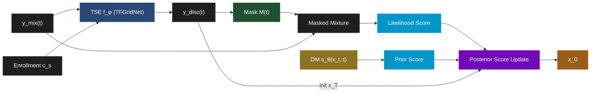

<h1 align="center">Joint Mixture-Guided Diffusion for Target Speech Extraction (TSE)</h1>

<p align="center">
  <a href="https://colab.research.google.com/github/AayushPrjapati/DPS-TSE/blob/main/demo.ipynb">💻 Colab Demo</a>
</p>

This repository contains the code for **Joint Mixture Guidance (V1)**, a training-free hybrid framework for Target Speech Extraction (TSE). 

This project was developed during a **Summer Research Internship (SRI)** at the **Speech Research Laboratory (SRL), DAU** under the guidance of **Dr. Hemant Patil**.

### What does it do?
It combines a discriminative model (**TFGridNet**) with a generative diffusion prior (**ArrayDPS**). 
* **The Problem:** Discriminative models isolate speakers well but introduce digital distortions and make voices sound robotic. Generative priors sound natural, but they tend to hallucinate words or drift into other speakers' voices.
* **Our Solution:** We use a dynamic energy mask from TFGridNet to guide ArrayDPS directly on the raw mixture. It keeps the speaker identity locked while restoring a natural voice texture (+0.34 DNSMOS boost).

---

## 📐 System Pipeline Architecture

We run target speech extraction in two phases:
1. **Phase 1 (Discriminative):** The mixture and enrollment reference are processed by TFGridNet in sliding 4-second windows to get an initial target voice approximation.
2. **Phase 2 (Generative Refinement):** The initial approximation is refined using reverse diffusion. An $L_2$ guidance loss binds the trajectories to the mixture envelope *only* within the active speech mask.



---

## 📈 Experimental Journey

Here is what we tried, step-by-step, before arriving at the final V1 framework:

1. **Discriminative Only (`TFGridNet`)**
   * *Limitation:* Great speaker separation and noise reduction, but introduced phase distortions and musical noise (robotic voice).
2. **Prior Only (`ArrayDPS`)**
   * *Limitation:* Natural voice texture, but suffered from speaker identity drift (voice morphed into someone else) and random speech hallucinations in silence.
3. **Guidance on Discriminative Output**
   * *Limitation:* Fixed speaker identity drift, but pulled the prior back to the distorted discriminative phase, retaining robotic artifacts.
4. **Guidance on Raw Mixture**
   * *Limitation:* Restored natural envelope, but leaked the background/interfering talker.
5. **Masked Guidance on Mixture (Joint Mixture Guidance - V1)**
   * *Result:* Best of both worlds. We only guide the prior on active target speaker zones, letting it denoise freely elsewhere. Natural texture (+0.345 DNSMOS), minimal distortions, and stable speaker identity.

---

## 🛠️ Setup & Usage

### 1. Clone & Install
```bash
git clone https://github.com/AayushPrjapati/DPS-TSE.git
cd DPS-TSE
pip install -r requirements.txt
```

### 2. Run Inference
You don't need to manually download checkpoint files. The script will automatically fetch `model_ckpt.pt` (3.2GB) and `temp_best.pth.tar` (188MB) if they are missing.

Run the pipeline on your own files or the test samples:
```bash
python run_v1_inference.py --mixture test_samples/LIBRI2MIX_mixture.wav --enrollment test_samples/LIBRI2MIX_s1.wav --output refined_output.wav
```

* `--mixture`: Input multi-speaker mixture file (8kHz `.wav`).
* `--enrollment`: Target speaker's enrollment audio (8kHz `.wav`).
* `--output`: Output path for the refined audio.

---

## 📊 Evaluation Results (Libri2Mix)

Summary of performance on the Libri2Mix 8kHz test dataset. Our Proposed V1 is compared against the discriminative baseline (TFGridNet):

| Method | D/G | SI-SNR (dB) $\uparrow$ | ESTOI $\uparrow$ | DNSMOS $\uparrow$ | WER (%) $\downarrow$ | SIM $\uparrow$ |
| :--- | :---: | :---: | :---: | :---: | :---: | :---: |
| **T = 100 Steps** | | | | | | |
| Raw Mixture | -- | -0.128 | 0.538 | 2.939 | N/A | N/A |
| TFGridNet | D | **12.450** | **0.877** | _3.201_ | **1.979** | **0.982** |
| Proposed (Our V1) | G | _12.287_ | _0.834_ | **3.546** | _2.445_ | _0.978_ |
| **T = 400 Steps** | | | | | | |
| Raw Mixture | -- | -0.235 | 0.550 | 3.006 | N/A | N/A |
| TFGridNet | D | **12.341** | **0.865** | _3.209_ | _1.662_ | **0.981** |
| Proposed (Our V1) | G | _12.111_ | _0.825_ | **3.549** | **1.512** | _0.978_ |
| **Noisy Environment (T = 100)** | | | | | | |
| Raw Noisy Mix | -- | -1.390 | 0.418 | 2.126 | N/A | N/A |
| TFGridNet | D | **9.828** | **0.768** | _3.104_ | **14.466** | _0.955_ |
| Proposed (Our V1) | G | _9.762_ | _0.742_ | **3.321** | _16.369_ | **0.965** |

### Key takeaways:
* **Naturalness:** Generative refinement raises speech naturalness (DNSMOS) by **+0.345** over the baseline.
* **Intelligibility:** Running 400 steps lowers the Word Error Rate (WER) to **1.512%** (absolute reduction of **0.150%** over baseline).
* **Fingerprint:** In noisy environments, the prior stabilizes target speaker traits, boosting WavLM speaker similarity (SIM) by **+0.010**.

---

## 🎓 Acknowledgment
Done under mentor **Dr. Hemant Patil** at the **Speech Research Laboratory (SRL), DAU**.Thanks to the Speech Research Lab team and the SRI program.
